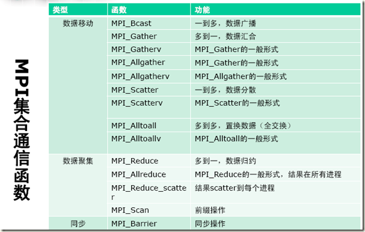

# 二、MPI_Collective_1--并行化梯形积分法:
## 伪代码：
```cpp
/* 串行程序伪代码 */
/* input a,b,n  n:划分段数*/
h = (b-a)/n;
approx = ( f(a) + f(b) ) / 2.0
for(i=1; i<=n-1; i++)
{
	approx += f( a + i*h );
}
approx = h*approx;
```
## main1.cpp--版本1 编译：
```
mpicxx -g -Wall -o mpi_hello.o main1.cpp 
```

## 运行及结果：
> 编译完成后，开始运行，可由-n后面的数字来调节创
建进程数。
```
mpirun -n 4 ./mpi_hello.o
```

> With n = 1024 trapezoids, our estimate
> 
> of the integral from 0.000000 to 3.000000 = 1.148197004588656e+01

## main2.cpp--版本2(加入数据输入和改用集合通信)：
> 在MPI中，涉及所有的进程的通信函数我们称之为集合通信（collective communication）。而单个进程对单个进程的通信，类似于MPI_Send和MPI_Recv这样的通信函数，我们称之为点对点通信（point-to-point communication）。

#### 特点
1. 在通信子中的所有进程都必须调用相同的集合通信函数。
2. 每个进程传递给MPI集合通信函数的参数必须是“相容的”。
3. 点对点通信函数是通过标签和通信子来匹配的。而通信函数不实用标签，只是通过通信子和调用的顺序来进行匹配。



#### 参数对比
> 集合通信 MPI_Reduce：
```cpp
(const void * sendbuf, void * recvbuf, int count, MPI_Datatype datatype, MPI_Op op, int root, MPI_Comm comm)
```
> 
> 点对点通信 MPI_Send：
```cpp
(const void * buf, int count, MPI_Datatype datatype, int dest, int tag, MPI_Comm comm)
```

## 记录
###### MPI_Allreduce和MPI_Reduce的一个区别就是，MPI_Reduce函数将最后的结果只传给了指定的dest_process 号进程，而MPI_Allreduce函数可以将结果传递给所有的进程，因此所有的进程都能接收到结果。MPI_Allreduce函数的原型也因此不需要指定目标进程号：
```cpp
int MPI_Reduce(
			void*			input_data_p	/* in */
			void*			output_data_p	/* out */
			int				count			/* in */
			MPI_Datatype	datatype		/* in */
			MPI_Op			operator		/* in */
			int				dest_process	/* in */
			MPI_Comm		comm			/* in */
			);

> int MPI_Reduce(
			void*			input_data_p	/* in */
			void*			output_data_p	/* out */
			int				count			/* in */
			MPI_Datatype	datatype		/* in */
			MPI_Op			operator		/* in */
			MPI_Comm		comm			/* in */
			);
```
