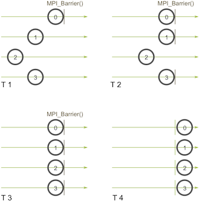
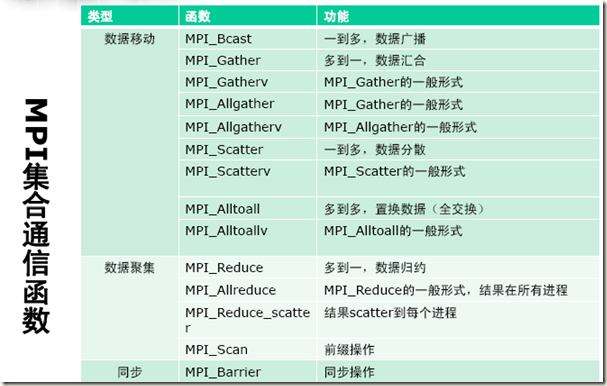
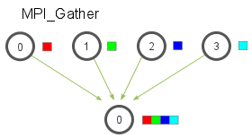

# MPI测试程序及笔记
## 简介
> MPI实现并行是进程级；采用的是分布式内存系统，显式（数据分配方式）实现并行执行，通过通信在进程之间进行消息传递，可扩展性好。MPI虽适合于各种机器，但它的编程模型复杂：

* 需要分析及划分应用程序问题，并将问题映射到分布式进程集合；
* 需要解决通信延迟大和负载不平衡两个主要问题；
* 调试MPI程序麻烦；
* MPI程序可靠性差，一个进程出问题，整个程序将错误；

**详情参见链接 http://mpitutorial.com/tutorials/**

## 发送和接收方法
MPI 的同步的（或阻塞的，blocking）。
```cpp
OMPI_DECLSPEC int MPI_Send(
    const void * buf, 
    int count, 
    MPI_Datatype datatype, 
    int dest, 
    int tag, 
    MPI_Comm comm)

OMPI_DECLSPEC int MPI_Recv(
    void * buf, 
    int count, 
    MPI_Datatype datatype, 
    int source, 
    int tag, 
    MPI_Comm comm, 
    MPI_Status * status)
```

## 集体通信以及同步点
* 关于集体通信需要记住的一点是它在进程间引入了同步点的概念。
* 这意味着所有的进程在执行代码的时候必须首先都到达一个同步点才能继续执行后面的代码。
* MPI_Barrier(MPI_Comm communicator)
* 进程0在时间点 (T 1) 首先调用 MPI_Barrier。然后进程0就一直等在屏障之前，之后进程1和进程3在 (T 2) 时间点到达屏障。当进程2最终在时间点 (T 3) 到达屏障的时候，其他的进程就可以在 (T 4) 时间点再次开始运行。

* **始终记得每一个你调用的集体通信方法都是同步的。**

## 集体（集合）通信函数

> MPI_Bcast:
> 广播（broadcast）的主要用途之一是**把用户输入传递给一个分布式程序，或者把一些配置参数传递给所有的进程。**
> MPI_Scatter:
> 给每个进程发送的是一个数组的一部分数据
> MPI_Gather:
> 调用时，只有根进程需要一个有效的接收缓存。所有其他的调用进程可以传递NULL给recv_data，别忘记recv_count参数是从每个进程接收到的数据数量，而不是所有进程的数据总量之和。这个机制**对很多平行算法很有用，比如并行的排序和搜索。**
```cpp
//把用户输入传递给一个分布式程序，或者把一些配置参数传递给所有的进程。
MPI_Bcast(
    void* data,
    int count,
    MPI_Datatype datatype,
    int root,
    MPI_Comm communicator)
//这个机制对很多平行算法很有用，比如并行的排序和搜索。
MPI_Scatter(
    void* send_data,
    int send_count,
    MPI_Datatype send_datatype,
    void* recv_data,
    int recv_count,
    MPI_Datatype recv_datatype,
    int root,
    MPI_Comm communicator)
//这个机制对很多平行算法很有用，比如并行的排序和搜索。
MPI_Gather(
    void* send_data,
    int send_count,
    MPI_Datatype send_datatype,
    void* recv_data,
    int recv_count,
    MPI_Datatype recv_datatype,
    int root,
    MPI_Comm communicator)
```




## 目录
#### 1.点到点通信，简单测试MPI：
* [MPI_Point_1](/MPI_Point_1/index.md)
#### 2.集合通信，并行化梯形积分法：
* [MPI_Collective_1](/MPI_Collective_1/index.md)
#### 3.点到点通信，随机漫步并行化实现：
* [MPI_Random_Walk](/MPI_Random_Walk/index.md)
#### 4.集合通信，MPI_Bcast讲解：
* [MPI_Cast](/MPI_Cast/index.md)
#### 5.集合通信，MPI_Scatter和MPI_Gather的使用：
* [MPI_Collective_2](/MPI_Collective_2/index.md)
